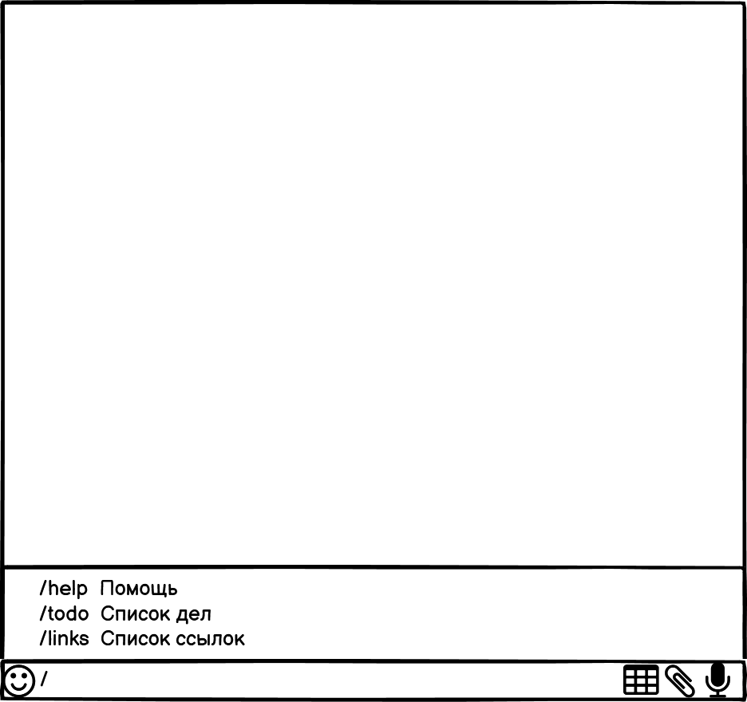
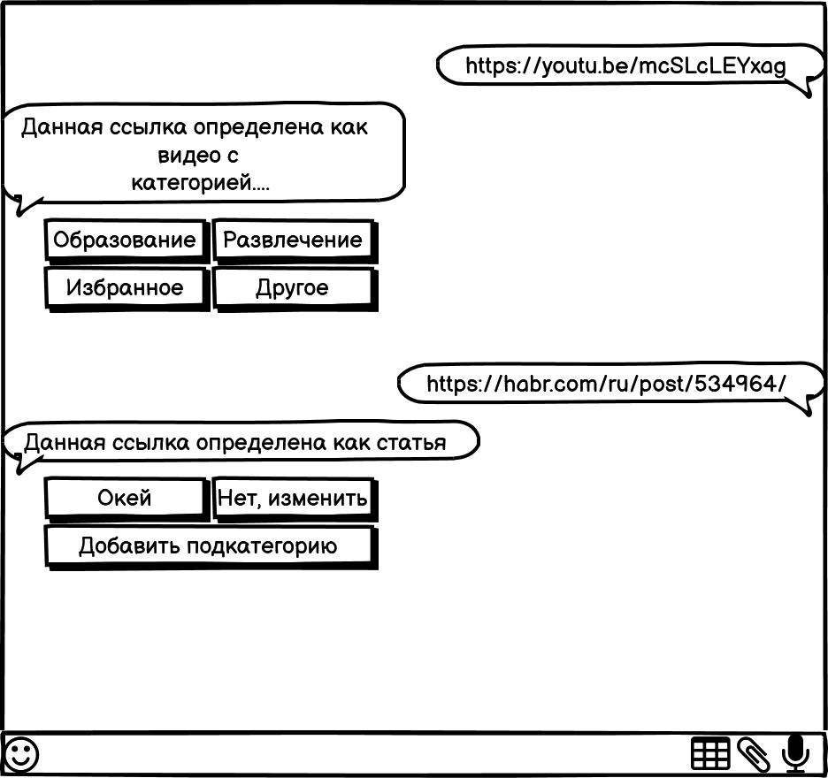

# Требования к проекту
---

# Содержание
1. [Введение](#intro)  
1.1 [Назначение](#appointment)  
1.2 [Бизнес-требования](#business_requirements)  
1.2.1 [Исходные данные](#initial_data)  
1.2.2 [Возможности бизнеса](#business_opportunities)  
1.3 [Аналоги](#analogues)  
1.3.1 [MyCloudStore](#MyCloudStore)  
1.3.2 [Заметки](#Notepad-Bot)  
2. [Требования пользователя](#user_requirements)  
2.1 [Программные интерфейсы](#software_interfaces)  
2.2 [Интерфейс пользователя](#user_interface)  
2.2.1 [Интерфейс меню](#user_interface_menu)  
2.2.2 [Интерфейс кнопок](#user_interface_button)  
2.3 [Характеристики пользователей](#user_specifications)  
2.3.1 [Аудитория приложения](#application_audience)  
2.3.1.1 [Целевая аудитория](#target_audience)  
2.3.1.1 [Побочная аудитория](#collateral_audience)  
2.4 [Предположения и зависимости](#assumptions_and_dependencies)  
3. [Системные требования](#system_requirements)  
3.1 [Функциональные требования](#functional_requirements)  
3.2 [Нефункциональные требования](#non-functional_requirements)  

<a name="intro"/>

# 1 Введение

<a name="appointment"/>

## 1.1 Назначение
Боты – это специальные программы, выполняющие различные функции и упрощающие жизнь их пользователей. Данный бот написан для "Telegram", следовательно, может быть использован на любой платформе, поддерживающей данный мессенджер. Данный бот предназначен для структурирования ссылок, заметок, прочей текстовой информации, а также для создания списков дел.

## 1.2 Бизнес-требования

<a name="initial_data"/>

### 1.2.1 Исходные данные
В современном темпе жизни, у каждого человека использующего интернет, накапливается множество информации, а именно: ссылки на статьи, таблицы, различные текстовые сообщения, прочие заметки. Всю эту информацию нужно не только сохранять, ее необходимо как-то структурировать и организовывать.

<a name="business_opportunities"/>

### 1.2.2 Возможности бизнеса
Данный бот будет пользоваться популярностью, у самых разных групп пользователей, использующих мессенджер "Telegram".

<a name = "analogues"/>

## 1.3 Аналоги

<a name = "MyCloudStore"/>

### 1.3.1 MyCloudStore

**Русский интерфейс:** да

**Цена:** бесплатно  
**Ссылка на бот:** https://t.me/tenvsten_bot

MyCloudStore - бот для заметок и ToDO планировщик. Сохраняет идеи, посты, события.

<a name = "Notepad-Bot"/>

### 1.3.2 Notepad-Bot

**Русский интерфейс:** да

**Цена:** бесплатно  
**Ссылка на бот:** https://t.me/tg_notepad_bot

Notepad-Bot - простой бот для создания записей с незамысловатым интерфейсом.

# 2 Требования пользователя

<a name="software_interfaces"/>

## 2.1 Программные интерфейсы

Разработка будет вестись с использованием языка программировани Python и библиотеки
pyTelegramBotAPI .

<a name="user_interface"/>

## 2.2 Интерфейс пользователя

Создаваемый программный продукт будет иметь классический для телеграм-ботов пользовательский интерфейс.

<a name="user_interface_menu"/>

### 2.2.1 Интерфейс бота

Интерфейс пользователя будет содержать окно ввода сообщения, которое необходимо отправить боту и меню выбора кнопок, из которого пользователь сможет выбрать необходимую ему команду. При вводе символа "/", пользователь увидит меню доступных команд. Также присутсвует кнопка для прикрепления к сообщению медиафайлов и документов, отправки голосового сообщения и кнопка для отправки стикеров.

<a name="user_interface_button"/>

### 2.2.2 Интерфейс кнопок
Когда пользователь пришлет боту ссылку или заметку, ему будет доступно немедленное ее сохранение, изменение типа сохраняемого сообщения(если по какой-то причине бот неправильно определил ее тип) и добавление подкатегории, для более подробной структуризации.

<a name="user_specifications"/>

## 2.3 Характеристики пользователей

Программный продукт нацелен на рядового пользователя, зарегистрированного в "Telegram".
<a name="user_classes"/>

### 2.3.1 Аудитория приложения

<a name="target_audience"/>

#### 2.3.1.1 Целевая аудитория

Активные пользователи сети интернет и мессенджера "Telegram", желающие организовать хранения большого множества ссылок и заметок.

<a name="collateral_audience"/>

#### 2.3.1.2 Побочная аудитория
Рядовые пользователи мессенджера "Telegram", желающие значительно упростить хранение ссылок и заметок.

<a name="assumptions_and_dependencies"/>

## 2.4 Предположения и зависимости

1. Программный продукт предполагает наличие клавиатуры и мыши, в случае использования его на персональных компьютерах.
2. Для использования программный продукта необходимо наличие у пользователя аккаунта в мессенджере "Telegram".

<a name="system_requirements"/>

# 3 Системные требования

Создаваемый программный продукт создается для систем, поддерживающих запуск мессенджера "Telegram".

<a name="functional_requirements"/>

## 3.1 Функциональные требования
1. Понятный пользовательский интерфейс
2. Возможность удаления и редактирования записей

<a name="non-functional_requirements"/>

## 3.2 Нефункциональные требования
Для создаваемого продукта необходима невысокая требовательность к ресурсам устройства.
